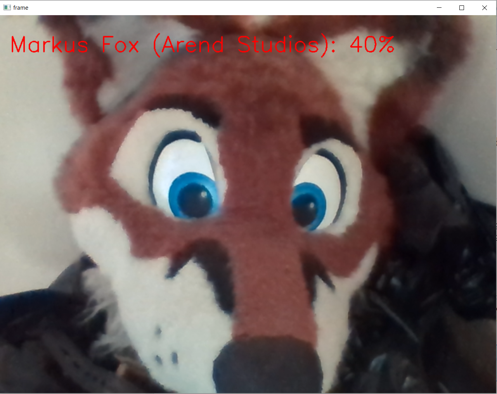

# FursuitWebcam

I have a neural network I've been working on for a while. It takes an image and tries to determine which fursuit it is. Until now, it's just been a Telegram bot.

Inspired by https://twitter.com/furconai I decided to make a portable version that you can take to a furcon and use with a webcam.

To use, you'll need a computer with a webcam.

1. Install python, and the packages opencv and tensorflow.
2. type "python fursuitwebcam.py"
3. Open the file "fursuitai.txt" in a Notepad window and put it alongside the webcam window, so that passersby understand, or maybe even print it out.
4. Place it somewhere where passersby will be visible in the webcam and can see the screen. Good lighting is essential.
5. Make sure the power-saving settings won't turn off the screen.
6. Press "q" in the window when you are done.

I wrote this the night before an event, so there's redundant code and could be made more flexible. Happy to accept contributions.

If you do plan to take it to a convention, let me know, and I'll try to have a up-to-date neural network ready for you with the latest changes by the start of the event.

## Legal

Shutter sound from https://pixabay.com/sound-effects/camera-13695/
OpenAI says they don't use data from their ChatGPT APIs to train models, but it's not under my control.
