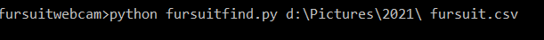
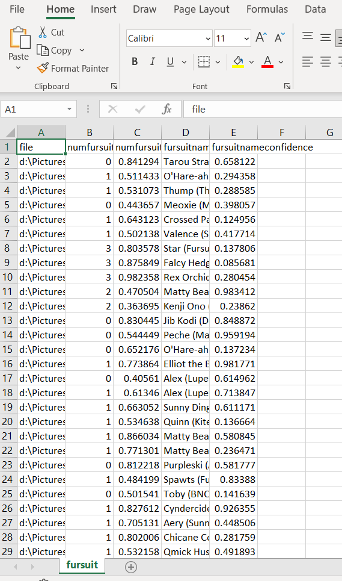
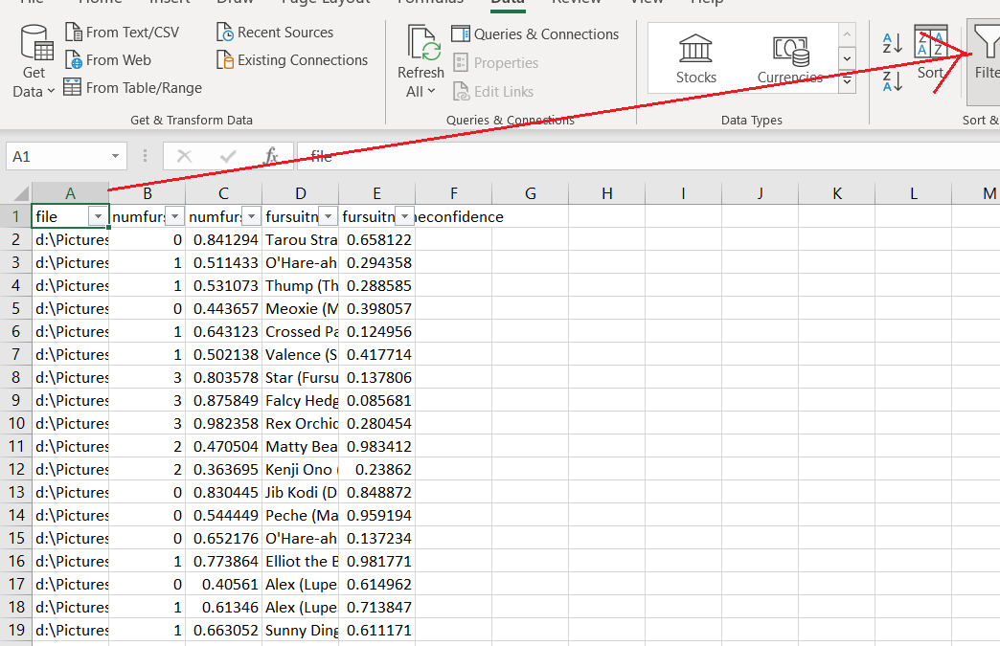
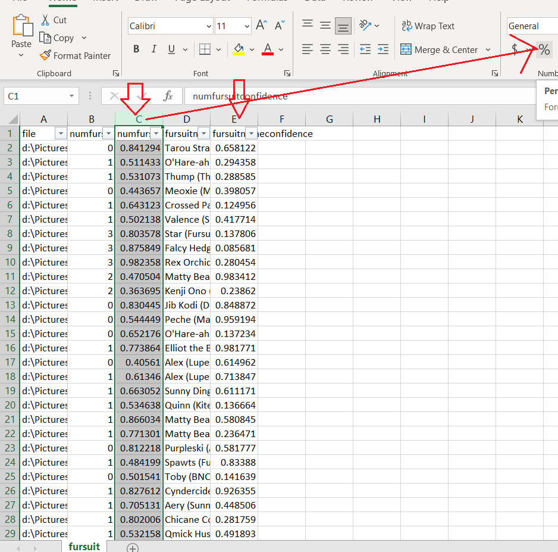
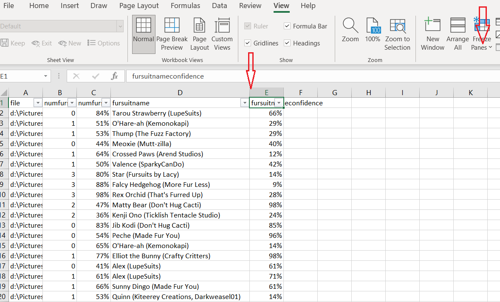
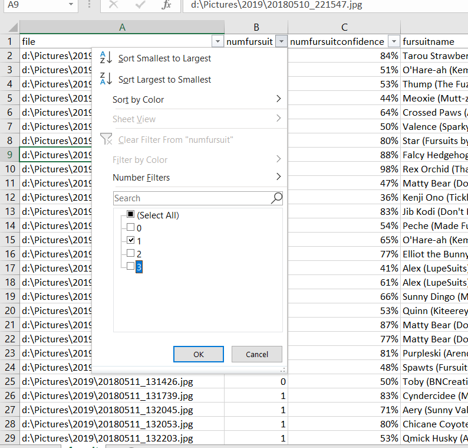
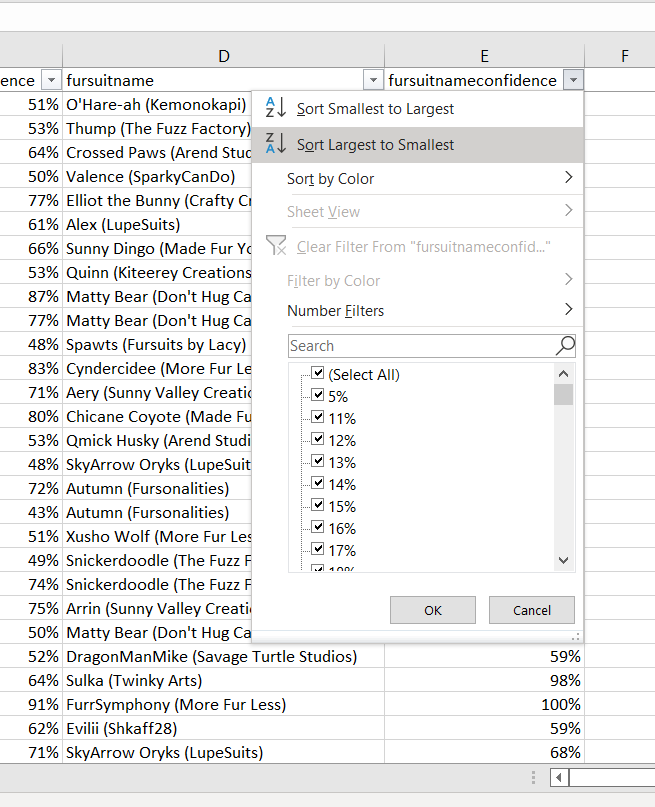
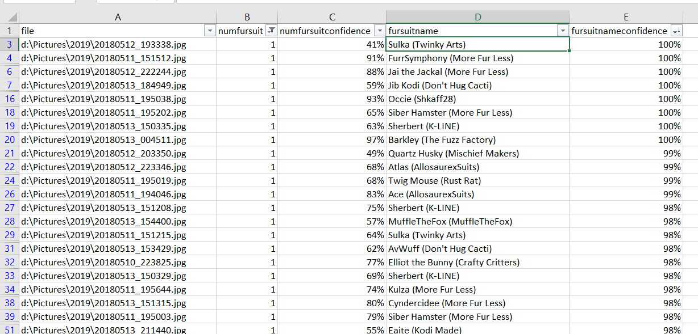

"# FursuitFind" 

Hooked up my fursuit identification network to a python program you can just point at a directory and let it work.

It probably isn't for the casual user. More for someone who already knows some computer basics and has a LOT of fursuit photos.

Point it at the directory you want it to work on, and a .csv file to write to.

You can use a .csv file in lots of things, but let's use Excel.

Under Data, turn on the Filter

(optional) Format numfursuitconfidence and fursuitnameconfidence as a percentage.

(optional) Adjust the width of the columns, and Freeze the top row.

(optional) Let's try a filter so only photos that appear to have exactly one fursuit show up.

(optional) Let's sort by fursuitnameconfidence in descending order. 

All done! The ones that the network is most confident in will be at the top. You can now let the fursuit owners know that you have photos ready for them. Or tag them in your favourite fursuit photo tagging website.

